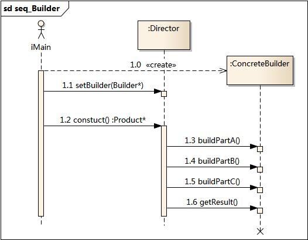

# 建造者模式(Builder Pattern)
## 简介
生成器模式是一种对象构建模式。它可以将复杂对象的建造过程抽象出来（抽象类别），使这个抽象过程的不同实现方法可以构造出不同表现（属性）的对象。

### 范例
```
 /** "Product" */
 class Pizza {
   private String dough = "";
   private String sauce = "";
   private String topping = "";
 
   public void setDough (String dough)     { this.dough = dough; }
   public void setSauce (String sauce)     { this.sauce = sauce; }
   public void setTopping (String topping) { this.topping = topping; }
 }
 
 
 ''/** "Abstract Builder" */''
 abstract class PizzaBuilder {
   protected Pizza pizza;
 
   public Pizza getPizza() { return pizza; }
   public void createNewPizzaProduct() { pizza = new Pizza(); }
 
   public abstract void buildDough();
   public abstract void buildSauce();
   public abstract void buildTopping();
 }
 
 /** "ConcreteBuilder" */
 class HawaiianPizzaBuilder extends PizzaBuilder {
   public void buildDough()   { pizza.setDough("cross"); }
   public void buildSauce()   { pizza.setSauce("mild"); }
   public void buildTopping() { pizza.setTopping("ham+pineapple"); }
 }
 
 /** "ConcreteBuilder" */
 class SpicyPizzaBuilder extends PizzaBuilder {
   public void buildDough()   { pizza.setDough("pan baked"); }
   public void buildSauce()   { pizza.setSauce("hot"); }
   public void buildTopping() { pizza.setTopping("pepperoni+salami"); }
 }
 
 
 ''/** "Director" */''
 class Waiter {
   private PizzaBuilder pizzaBuilder;
 
   public void setPizzaBuilder (PizzaBuilder pb) { pizzaBuilder = pb; }
   public Pizza getPizza() { return pizzaBuilder.getPizza(); }
 
   public void constructPizza() {
     pizzaBuilder.createNewPizzaProduct();
     pizzaBuilder.buildDough();
     pizzaBuilder.buildSauce();
     pizzaBuilder.buildTopping();
   }
 }
 
 /** A customer ordering a pizza. */
 class BuilderExample {
   public static void main(String[] args) {
     Waiter waiter = new Waiter();
     PizzaBuilder hawaiian_pizzabuilder = new HawaiianPizzaBuilder();
     PizzaBuilder spicy_pizzabuilder = new SpicyPizzaBuilder();
 
     waiter.setPizzaBuilder ( hawaiian_pizzabuilder );
     waiter.constructPizza();
 
     Pizza pizza = waiter.getPizza();
   }
 }
```
抽象工厂模式与生成器相似，因为它也可以创建复杂对象。主要的区别是生成器模式着重于一步步构造一个复杂对象。而抽象工厂模式着重于多个系列的产品对象（简单的或是复杂的）。生成器在最后的一步返回产品，而对于抽象工厂来说，产品是立即返回的。

## 实例
。

建造者模式包含如下角色：

* Builder：抽象建造者
* ConcreteBuilder：具体建造者
* Director：指挥者
* Product：产品角色


### 实序图



建造者模式主要是用于创建一些复杂的对象，这些对象内部构建间的建造顺序是稳定的，但是对象内部的构建通常面临着复杂的变化。

建造者模式的好处就是使得建造代码与表示代码分离，由于建造者隐藏了改产品是如何组装的，所以若需要改变一个产品的内部表示，只需要再定义一个具体的建造者就可以了。


